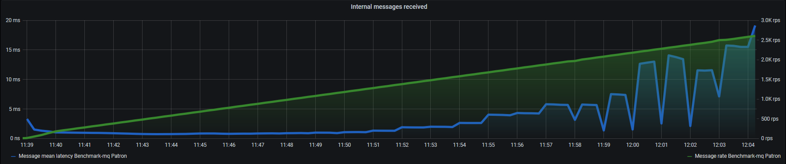
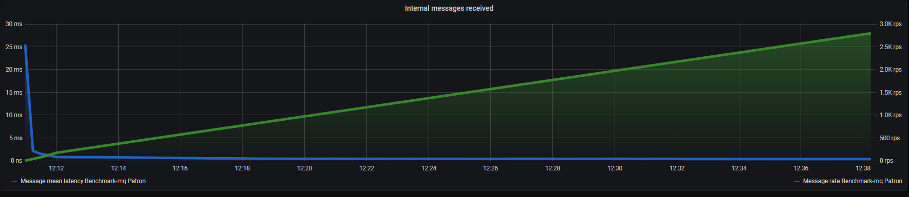

# benchmark-mq
A benchmark application comparing message queue implementations
* ActiveMQ
* RabbitMQ
* Pulsar
* Nats
* Redis
* Kafka
* NSQ

## Technology stack
* jdk15
* gradle-6.7
* spring boot 2.4
* lombok 1.18
* jackson 2.12

## Setup
#### Host machine: producer and consumer
| CPU                               | CORES   | RAM        |
| --------------------------------- | ------  | ---------- |
| Inter Core i7-4720 @ 2.60GHz      | 4       | 8GB DDR3   |

#### Host machine: broker
| CPU                               | CORES   | RAM        |
| --------------------------------- | ------  | ---------- |
| Inter Core i7-4720 @ 2.60GHz      | 1       | 1GB DDR3   |

## Results
| Transport      | Latency min      | Latency mean       | Latency max        | Max processed | Message persistence | Notes                            |
| -------------- | ---------------- | ------------------ | ------------------ | ------------- | ------------------- | -------------------------------- |
| ActiveMQ       | 5 ms             | 2 s                | 25 s               | 570/s         | Disabled            | Disappointing with more messages |
| RabbitMQ       | 1 ms             | 2 ms               | 15 ms              | 3.6K/s        | Disabled            | Good latencies, sub-par throughput with best libraries/examples |
| Pulsar         | 1 ms             | 3 ms               | 5 ms               | 26K/s         | Disabled            | On-par with Kafka only after disabling persistence |
| Nats           | 0.6 ms           | 0.6 ms             | 1.1 ms             | 26K/s         | None                | Sub-ms latency with ~15K msgs/s. Hands-down best results   |
| Redis          | 0.4 ms           | 0.6 ms             | 25 ms              | 3.5K/s        | None                | Low latencies but not the best throughput       |
| Kafka          | 2 ms             | 3 ms               | 10 ms              | 26K/s         | Can't disable       | All-round great despite persisting all messages |
| Nsq            | 11 ms            | 26 ms              | 125 ms             | 3.5K/s        | None                | Outsider. Better latencies *after* 3000 msg/s   |

### Spring Cloud Stream impact
Additional runs have been carried out while utilizing [Spring Cloud Stream](https://spring.io/projects/spring-cloud-stream) which simplifies implementation at a small performance cost.
| Transport      | Latency min      | Latency mean       | Latency max        |
| -------------- | ---------------- | ------------------ | ------------------ |
| Nats           | 0.65 ms          | 0.8 ms             | 3 ms               |

### ActiveMQ
| Version                                             | Driver Library                       |
| --------------------------------------------------- | -----------------------------------  |
| Custom image: openjdk:11-jre-slim + ActiveMQ 5.16.0 | `spring-boot-starter-activemq`       |

- Problems caused by re-scheduling message production in a separate thread from the beginning
- Using `AsyncSend` helps *a lot*
- Weak results nevertheless, can't pass ~570 msg/s mark

### RabbitMQ
| Version                                        | Driver Library        |
| ---------------------------------------------- | --------------------  |
| Official image: rabbitmq:3.8-management-alpine | `spring-rabbit`       |

- Smooth and trouble-free cooperation till ~2 000 msg/s mark, multiple "hiccups" after that
- Feels lightweight and simple

### Pulsar
| Version                                   | Driver Library          |
| ----------------------------------------- | ----------------------  |
| Official image: apachepulsar/pulsar:2.6.2 | `pulsar-client:2.6.2`   |

- Very heavy image. Broker requires (by default) 2GB RAM to even boot up (!?!)
- Driver uses a baked-in, old version of Jackson (impossible to override it) so you have to serialize by han
- Rides the CPU from t=0
- Consistently keeps latency in check

### Nats
| Version                               | Driver Library      |
| ------------------------------------- | ------------------  |
| Official image: nats:2.1.8            | `jnats:2.8.0`       |

- Excellent results, latency < 1ms 99% of the time
- Modest requirements

### Redis
| Version                               | Driver Library                    |
| ------------------------------------- | --------------------------------  |
| Official image: redis:6.0-alpine      | `spring-boot-starter-data-redis`  |

- Multiple errors while sending messages
- Noticeable CPU load from broker
- Exceptional result nevertheless

### Kafka
| Version                                             | Driver Library                       |
| --------------------------------------------------- | -----------------------------------  |
| Custom image: openjdk:11-jre-slim + Kafka 2.5.0     | `kafka-clients:2.5.0`                |

- Very noticeable CPU load from broker
- Keeps up with other transports despite always persisting all messages

### Nsq
| Version                              | Driver Library                     |
| ------------------------------------ | ---------------------------------  |
| Official image: nsqio/nsq:v1.2.0     | `com.sproutsocial:nsq-j:1.0`       |

- Quirky in set-up (needs an additional service - nsqlookupd)
- Latency starts off poorly (~120 ms) but constantly increases (?!?) with message amount increase
- Only unofficial java driver
- Multiple exceptions while producing
- Nice admin interface counter

### Spring Cloud Stream + Nats
| Version                               | Driver Library                                           |
| ------------------------------------- | -------------------------------------------------------- |
| Official image: nats:2.1.8            | `jnats:2.8.0`, `nats-spring-cloud-stream-binder:0.4.0`   |

- Results only slightly affected, additional cost of `0.1 - 0.3 ms`
